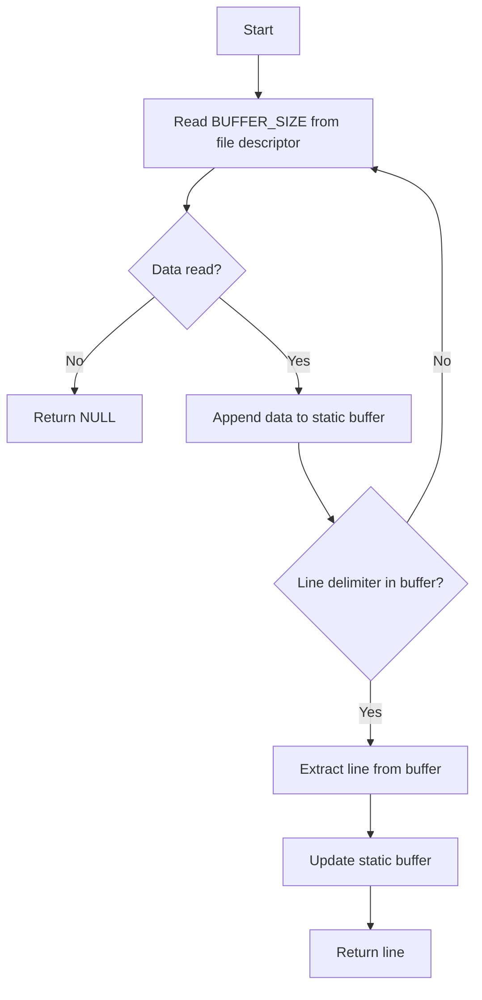

# Get Next Line

This repository contains the implementation of the **get_next_line** function, a utility to read a file line by line. This README provides an overview of the project structure, functionality, and flow using diagrams and descriptions. The file is designed for easy updates.

## Table of Contents

1. [Project Overview](#project-overview)
2. [Directory Structure](#directory-structure)
3. [How It Works](#how-it-works)
4. [Usage](#usage)
5. [Flowchart](#flowchart)
6. [Contributing](#contributing)

---

## Project Overview

The **get_next_line** function is a key utility function often used in various projects. It reads lines of text from a file descriptor one at a time, making it highly useful for processing large files.

### Features

- Reads a file line by line efficiently.
- Handles multiple file descriptors simultaneously.
- Includes robust error handling.

---

## Directory Structure

```plaintext
get_next_line/
├── srcs/
│   ├── get_next_line.c        # Core logic of get_next_line
│   ├── get_next_line_utils.c  # Helper functions
│   └── Makefile               # Build script
├── includes/
│   └── get_next_line.h        # Header file with function prototypes
└── tests/
    └── test_gnl.c             # Test cases for get_next_line
```

---

## How It Works

The **get_next_line** function operates using a static buffer to store unread data from the file descriptor. This allows efficient handling of input, especially for large files.

### Key Steps:

1. **Reading from the File Descriptor**: Reads chunks of data (defined by `BUFFER_SIZE`) from the file.
2. **Buffer Management**: Maintains leftover data for subsequent reads.
3. **Line Extraction**: Extracts a complete line from the buffer.
4. **Return**: Returns the extracted line or `NULL` when EOF is reached.

---

## Usage

1. Include `get_next_line.h` in your project:
   ```c
   #include "get_next_line.h"
   ```
2. Call `get_next_line` in your program:
   ```c
   char *line;
   while ((line = get_next_line(fd)) != NULL) {
       printf("%s\n", line);
       free(line);
   }
   ```
3. Compile using the provided Makefile:
   ```bash
   make
   ```

---

## Flowchart

The following flowchart illustrates the logic of the **get_next_line** function:



---

## Contributing

Feel free to fork this repository, make your changes, and submit a pull request. Contributions are always welcome!

1. Fork the repository.
2. Clone your forked repository:
   ```bash
   git clone https://github.com/your-username/get_next_line.git
   ```
3. Create a new branch:
   ```bash
   git checkout -b feature-name
   ```
4. Commit your changes:
   ```bash
   git commit -m "Add new feature"
   ```
5. Push your changes:
   ```bash
   git push origin feature-name
   ```
6. Open a pull request on GitHub.

---

**License:** This project is licensed under the MIT License.

